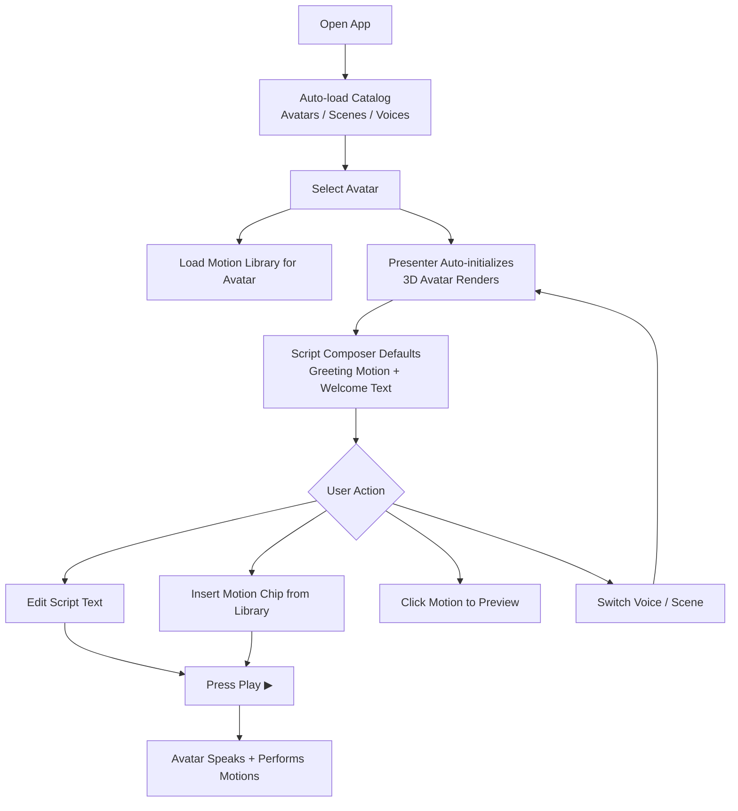

# Perxona Connect Kit — Tools

Web UI for previewing and controlling Perxona avatars via the Connect API and `<sv-presenter>` web component.

## Tech Stack

- **React 19** + TypeScript 6 + Vite 8
- **TanStack Query v5** for data fetching
- **Tailwind CSS 3** + shadcn/ui primitives
- **Presenter SDK** (`<sv-presenter>` custom element, loaded from CDN)

## Getting Started

Requires **Node `>=22`** — check with `node --version`. You'll also need a Connect **publishable** API key; if you
don't have one yet, see [Getting a Connect account](../../samples/express/README.md#getting-a-connect-account)
for the steps (sign up, then create a key of type **Publishable** at
[console.perxona.ai/asia/organization/integration/connect-api-keys](https://console.perxona.ai/asia/organization/integration/connect-api-keys/)).

```bash
pnpm install
cp .env.example .env
pnpm dev
```

### Environment Variables

Create `.env` from the included production template:

```bash
cp .env.example .env
```

The template contains the production API and presenter CDN settings, plus a blank slot for your key:

```env
VITE_PERXONA_API_BASE_URL=https://console.perxona.ai/asia
VITE_PRESENTER_URL=https://cdn.perxona.ai/asia/prod/latest/widget/entry/presenter.js
VITE_PERXONA_CONNECT_PUBLISHABLE_KEY=
```

Run `cp .env.example .env` again whenever you want to recreate the local
configuration. Edit `.env` to fill in your key, or when using a different
Perxona region or a custom presenter CDN. The `.env` file is ignored by Git;
do not commit it.

| Variable                               | Purpose                                                                                                     |
| -------------------------------------- | ----------------------------------------------------------------------------------------------------------- |
| `VITE_PERXONA_API_BASE_URL`            | Base URL for the Perxona Connect REST API                                                                   |
| `VITE_PRESENTER_URL`                   | CDN URL for the presenter engine script                                                                     |
| `VITE_PERXONA_CONNECT_PUBLISHABLE_KEY` | Connect publishable API key. Set its allowed domains before shipping — see `.env.example`'s comment for why |

## Project Structure

```text
src/
├── App.tsx                    # Main layout
├── components/custom/         # App-specific UI components
│   ├── app-header.tsx         # Top bar
│   ├── motion-library.tsx     # Motion grid with search/filter
│   ├── preset-avatar-select.tsx # Horizontal avatar picker
│   ├── scene-select.tsx       # Scene thumbnail selector
│   └── script-composer.tsx    # Rich-text editor with motion chips
├── components/ui/             # shadcn/ui primitives
├── hooks/
│   ├── use-avatar-session.ts  # Presenter lifecycle (launch/speak/playMotion)
│   ├── use-catalog.ts         # Avatars, voices, scenes queries
│   ├── use-motions.ts         # Motion list per avatar
│   └── use-presenter.ts       # Imperative <sv-presenter> handle
├── lib/
│   ├── api.ts                 # REST client, authenticates with X-Connect-Key
│   ├── env.ts                 # Env var access, including the connect key
│   └── presenter.ts           # CDN script loader
└── styles/tokens.css          # Design tokens
```

## Features

- **Avatar Preview** — Full-screen 3D avatar rendering with real-time character switching
- **Speech Synthesis** — Type text and press Play; the avatar speaks with lip-sync
- **Motion Library** — Browse, search, and filter motions; click to preview, copy Motion ID
- **Script Composer** — Rich-text editor mixing free text with Motion chip tags; avatar performs them in sequence
- **Scene & Voice Switching** — Bottom control bar for instant scene/voice changes
- **Motion Tag Insertion** — "+" button inserts a motion into the script for timed playback
- **Auto-launch** — Presenter initializes automatically when avatar/scene/voice is selected
- **Key-Based Auth** — No login step; a build-time Connect publishable key authenticates every request

## User Flow



### Step-by-Step

1. **Select Avatar** — Pick a character from the horizontal list; presenter auto-initializes
2. **Select Voice / Scene** — Use the bottom control bar to switch voice style and background
3. **Write Script** — Type what you want the avatar to say in the Script Composer
4. **Insert Motion** — Find a motion in the library, press "+" to add it to the script (or click to preview)
5. **Play** — Press the Play button; the avatar speaks and performs motions in sequence

## Key Flows

**Auth:** Build-time `VITE_PERXONA_CONNECT_PUBLISHABLE_KEY` → sent as `X-Connect-Key` on every REST call and
handed to the presenter directly — no login, no token exchange.

**Presenter:** `presenter.initializeWithConnectKey(key, {avatarId, sceneId, voiceId})` →
`presenter.present(text)` for speech + lip-sync.

**Motions:** Click a motion block to preview it (`playMotion`). Use the "+" button to insert it into the Script Composer.

## Scripts

| Command        | Description                   |
| -------------- | ----------------------------- |
| `pnpm dev`     | Start local dev server        |
| `pnpm build`   | Type-check + production build |
| `pnpm lint`    | Run ESLint                    |
| `pnpm preview` | Preview production build      |

## Troubleshooting

For Presenter SDK issues not specific to this tool, see [Presenter SDK Integration
FAQs](../../README.md#presenter-sdk-integration-faqs) in the repo root README.
